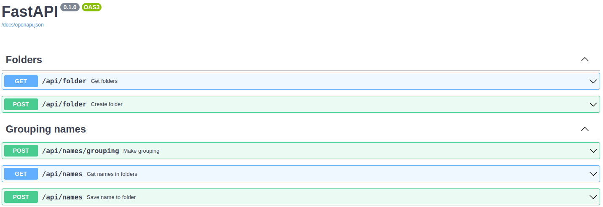

# Exercise 1:
To run grouping words from CLI:
```sh
cd app
python run_grouping.py
```

# Exercise 2:
This is a simple project to demonstrate knowledge in REST API using [FastAPI](https://github.com/tiangolo/fastapi) web framework

---
## Quick start
To test a repository, simply follow these steps:

```sh
$ git clone https://github.com/shardbread/home_challenge.git
$ cd home_challenge
$ cp .env-example .env
$ docker-compose up --build -d
```
I didn't add user authentication (I can do if needed) . This is a public API.

Use this [swagger](http://localhost/docs/) link and try to use the API.

You will see something like this:


---